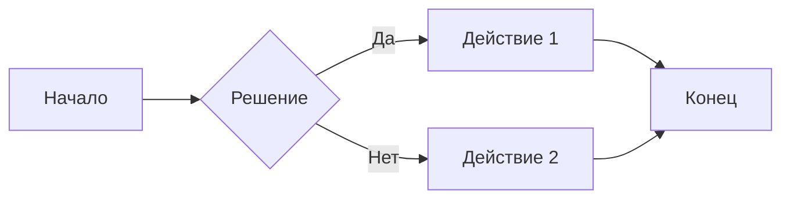
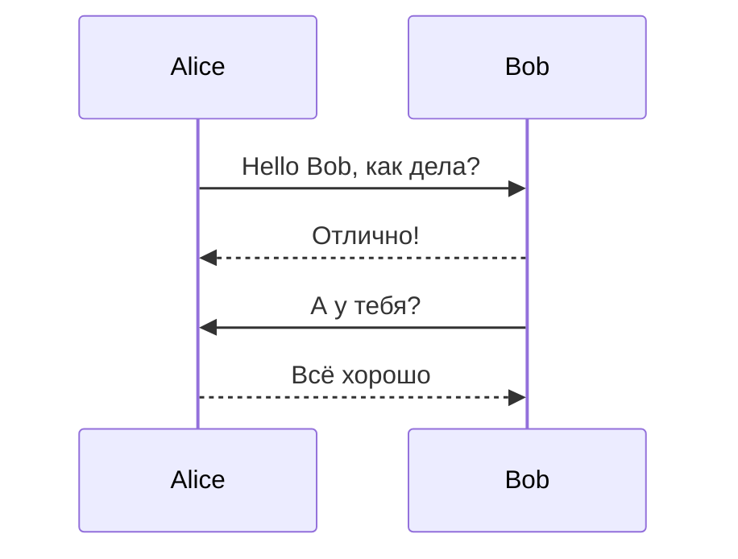
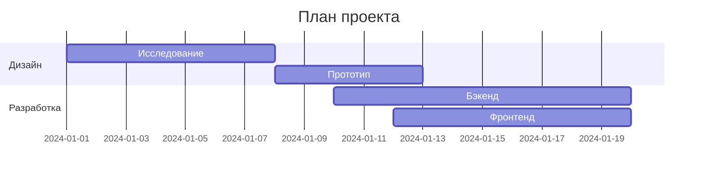
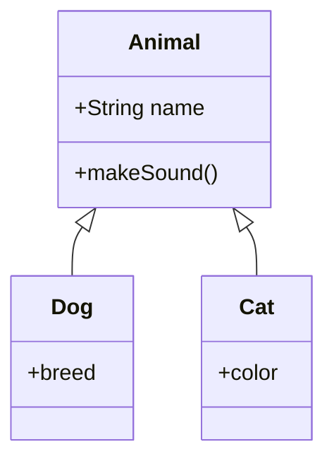
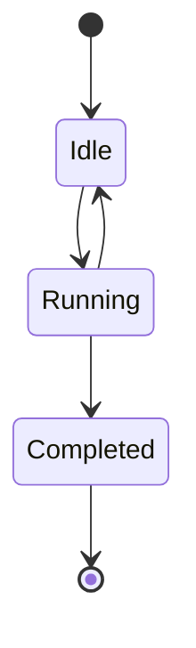
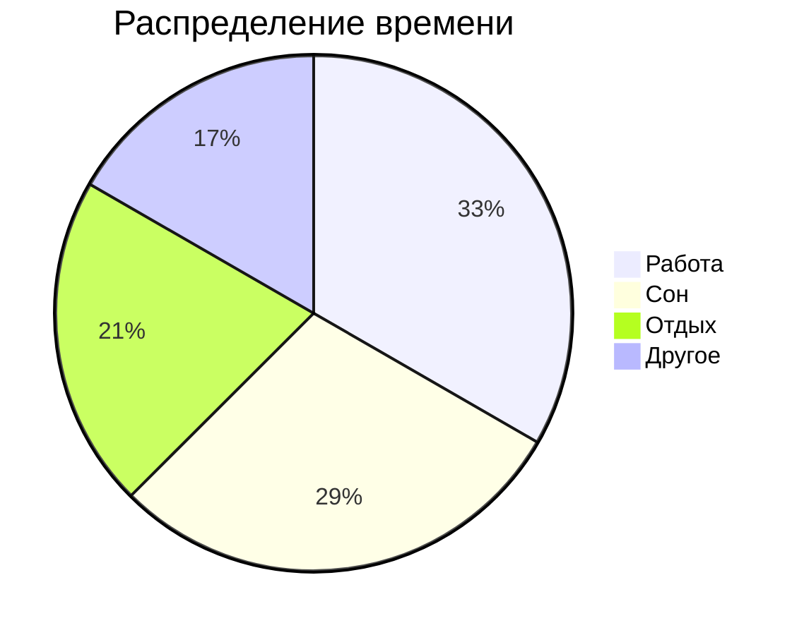
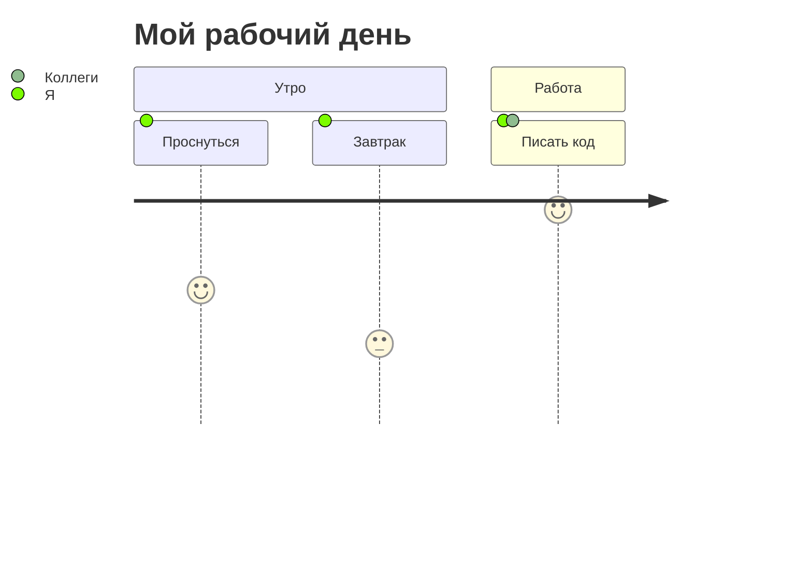
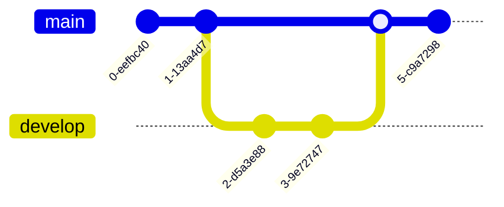

# Диаграммы Mermaid в Markdown

Mermaid позволяет создавать диаграммы и схемы с помощью текстового описания.

## 1. Flowchart (Блок-схема)

## 2. Sequence Diagram (Диаграмма последовательности)

## 3. Gantt Chart (Диаграмма Ганта)

## 4. Class Diagram (Диаграмма классов)

## 5. State Diagram (Диаграмма состояний)

## 6. Pie Chart (Круговая диаграмма)

## 7. User Journey (Путь пользователя)

## 8. Git Graph (Граф Git)

> 💡 Для рендеринга Mermaid-диаграмм используйте поддержку в GitHub, GitLab, VS Code (расширение Markdown Preview Mermaid Support) или Obsidian.
